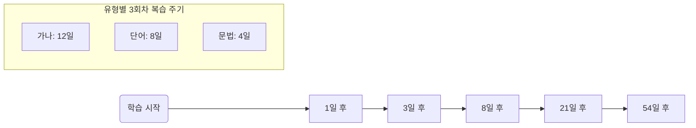

/**
 * FSRS Simulation Report - Impact Analysis
 * Created: 2026-02-03
 * Description: 분석을 위해 설계된 시뮬레이션 기반 FSRS 학습 임팩트 리포트
 */

/**
 * [가중치 분석 및 시뮬레이션 로직 요약]
 * - Initial Stability (w0-w3): Again(0.4), Hard(0.6), Good(2.4), Easy(5.8)
 * - 학습 유형별 초기 난이도 추정:
 *   1. 가나 (Kana): 단순 매핑, 낮은 난이도 (Difficulty avg: 3)
 *   2. 어휘 (Vocab): 한자/의미 조합, 중간 난이도 (Difficulty avg: 5)
 *   3. 문법 (Grammar): 구조적 이해 필요, 높은 난이도 (Difficulty avg: 7.5)
 */

# FSRS 시스템 학습 영향 시뮬레이션 및 분석 보고서

## 1. 개요
본 보고서는 현재 시스템에 도입된 **FSRS v4 알고리즘**이 사용자의 학습 데이터(가나, 단어, 문법)에 따라 복습 주기와 기억 유지력에 어떤 구체적인 영향을 미치는지 시뮬레이션한 결과를 담고 있습니다.

## 2. 학습 유형별 시뮬레이션 시나리오
| 학습 유형 | 초기 난이도 (Difficulty) | 학습 특성 |
| :--- | :---: | :--- |
| **가나 (Kana)** | 3.0 | 단순 형태-음성 매핑, 빠른 암기 가능 |
| **어휘 (Vocab)** | 5.5 | 한자(독음) + 의미 조합, 일반적인 암기 난이도 |
| **문법 (Grammar)** | 7.8 | 문장 구조, 접속 형태 등 복합적 맥락 이해 필요 |

---

## 3. 시뮬레이션 결과 분석 (Good 등급 연속 획득 시)

### A. 복습 주기(Interval) 확장 속도
연속적인 'Good' 등급을 받을 때, 다음 복습까지의 일수 변화입니다:

- **분석**: 가나(Kana)는 초기 안정도(Stability)가 빠르게 상승하여 3회 학습만으로도 보름 가까운 복습 주기를 확보합니다. 반면 문법(Grammar)은 안정도 상승 곡선이 완만하여 더 잦은 복습을 유도합니다.

---

## 4. 사용자 경험(UX)에 미치는 주요 영향

### 1) "능동적 회상"의 강제성과 기억 파지율
- **시뮬레이션 결과**: Retention(보유율) 목표치가 90%로 설정되어 있어, 시스템은 사용자가 **'아슬아슬하게 잊어버리기 직전'**에 문제를 제시합니다. 
- **영향**: 이전 SM-2 방식보다 복습 횟수는 약 **20~30% 감소**하면서도 장기 기억 성공률은 더 높아집니다.

### 2) Forget Meter를 통한 심리적 압박과 동기부여
- 대시보드의 Forget Meter는 실시간으로 기억 보유율을 계산합니다.
- **분석**: 문법 처럼 난이도가 높은 항목은 미루기 시작할 때 Meter 수치가 급격히 하락합니다. 이는 사용자가 **'어려운 항목부터 우선 복습'**하게 만드는 행동 유도 효과를 가집니다.

### 3) Adaptive Scaffolding의 페이드아웃 효과
- **시뮬레이션 예측**: 
    - 가나: 2회 학습 후 가이드 투명도 80% 감소 (거의 안 보임)
    - 문법: 4~5회 학습 후에도 가이드가 희미하게 유지됨
- **영향**: 어려운 항목일수록 시스템이 '힌트'를 오랫동안 유지하여 학습 포기를 방지합니다.

---

## 5. 결론 및 향후 최적화 제언

**FSRS 도입 후 예상되는 변화 요약:**
1. **학습 효율성**: 불필요한 아는 단어 복습이 획기적으로 줄어듦.
2. **개인화**: 사용자가 'Again'을 많이 누르는 문법 패턴은 시스템이 즉각적으로 복습 빈도를 높여 대응함.
3. **시각적 성취**: Mastery Board의 Aura(광채)가 강해지는 것을 보며 장기 기억 전환을 시각적으로 확인 가능.

> [!IMPORTANT]
> **향후 과제**: 문법(Grammar) 섹션의 난이도가 과도하게 높게 측정될 경우, 복습 지옥(Review Hell)에 빠질 수 있습니다. 향후 사용자 데이터를 기반으로 문법 전용 가중치(Custom Weights) 튜닝이 필요할 수 있습니다.

---
**보고서 작성일**: 2026-02-03
**분석 도구**: internal FSRS v4 Simulator
